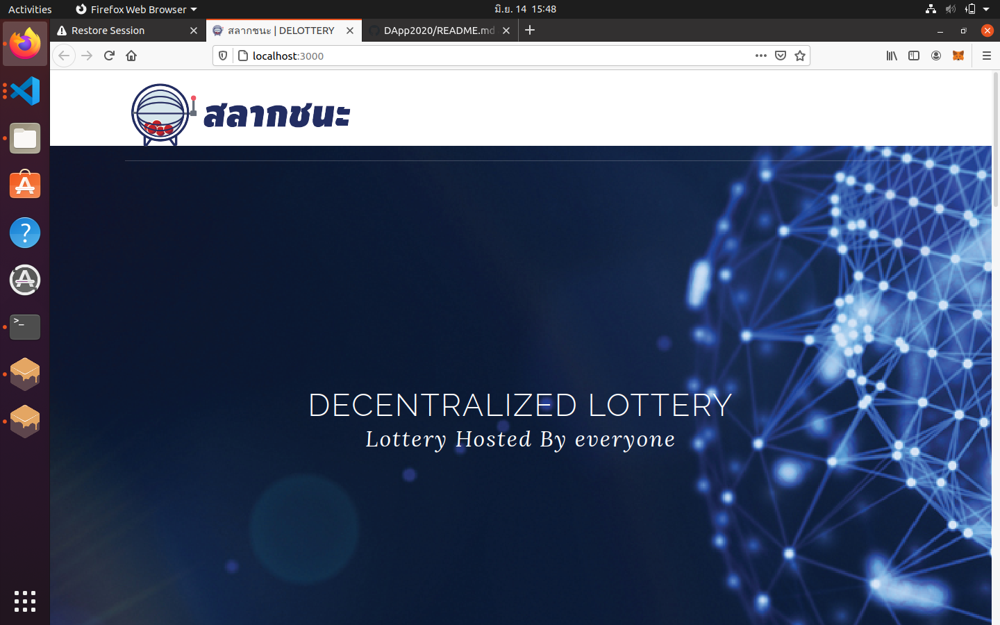
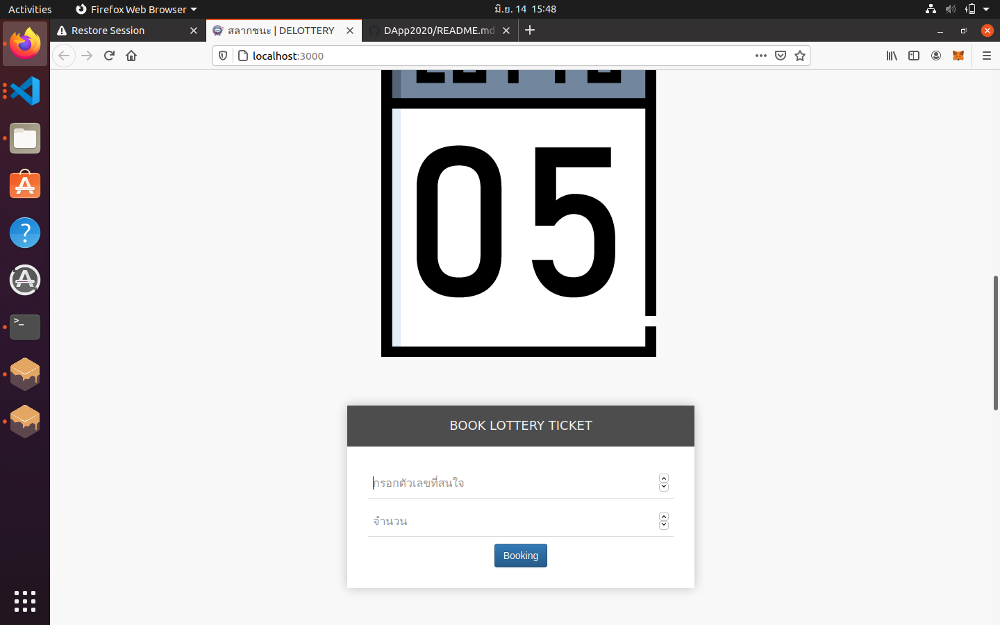
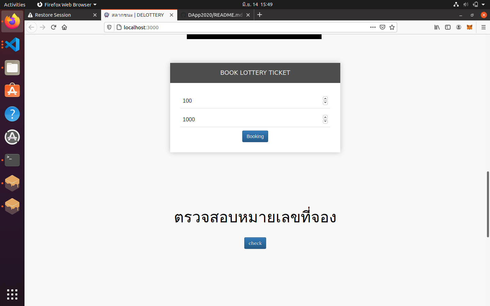
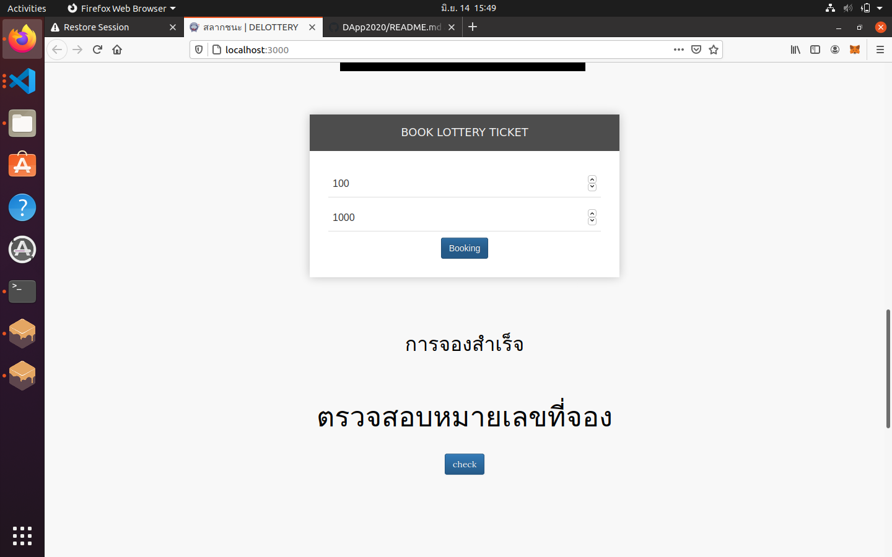
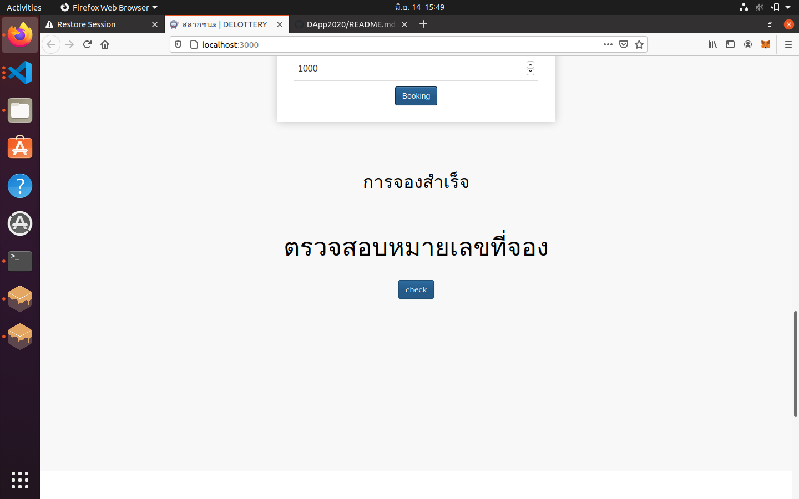
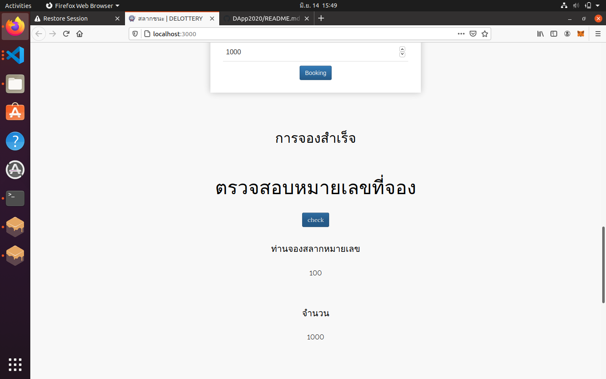
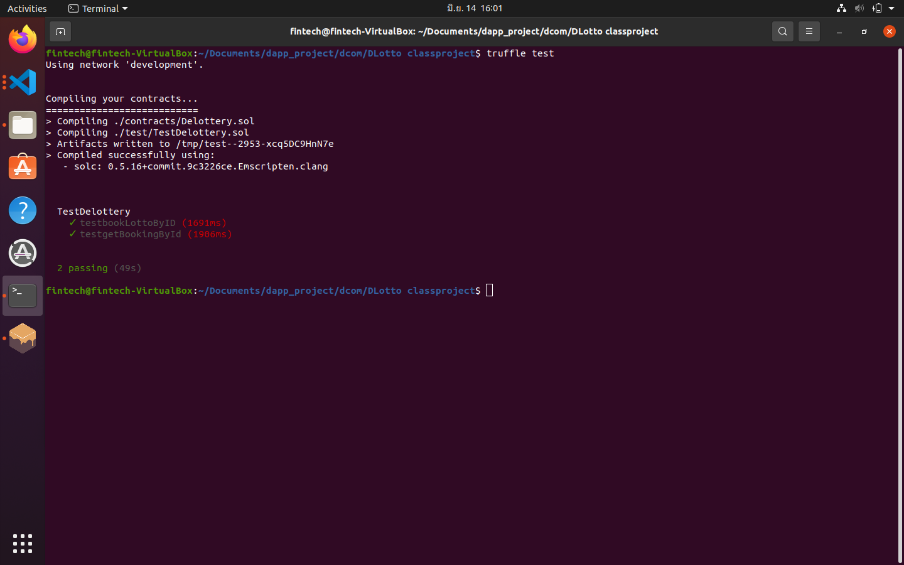

# Assignment 3: Class Project NF507 DApp
โดย นาย จิรกิตติ์ ลิ้มสมบูรณ์ รหัส 1920731303018

## 1.บทนำ แสดงวัตถุประสงค์ของโครงการ

1.1 วัตถุประสง เพื่อ สร้าง decentralized applications ที่ให้บริการจอง สลากออนไลน์
โดยมี business requirement ดังต่อไปนี้
* ระบบจะต้องรับค่า หมายเลขที่สนใจ และ ปริมาณการสั่งจอง จากทางหน้าเว็บ
* ระบบจะต้องบันทึก Address ของผู้จอง หมายเลขที่จอง พร้อม จำนวนการสั่งจอง
* ระบบจะต้อส่งข้อมูล รายงานกลับๆไปที่หน้าเว็บเพื่อเป็นการแสดงว่า การสั่งจองสำเร็จ 
</br>

## 2.การวิเคราะห์และออกแบบ (Analysis & Design) เช่น การออกแบบ Smart Contract ที่ใช้งานในโครงการ, การวิเคราะห์และออกแบบ Front-End/Back-End ที่เกี่ยวข้อง เป็นต้น
จาก  business requirement ทั้ง 3 ข้อ เราสามารถแบ่่งการทำงานออกเป็น 2 ส่วนช คือ Front-End/Back-End </br></br>
2.1 เริ่มต้นจากส่วน Back-End </br>
* สร้างที่เก็บข้อมูล โดย จะต้องเก็บ Address ของผู้จอง หมายเลขที่จอง พร้อม จำนวนการสั่งจอง
* สร้างฟังก์ชั่น การเขียนเพิ่มข้อมูลลงไปในที่เก็บข้อมูล โดยรับข้อมูลจาก หน้าเว็บ(Front-End)
* สร้างฟังก์ชั่น การคืนค่าผลของการจองกลับสู่(Front-End)

</br>

2.2 ในส่วนของ Smart Contract</br>
* struct  ในการสร้างฐานข้อมูล </br></br>
* function ที่ 1 จองสลาก Address ของผู้จอง หมายเลขที่จอง พร้อม จำนวนการสั่งจอง  </br>
จากนั้นคืนค่า หมายเลขที่จอง จำนวนการสั่งจอง พร้อมผลลัพท์การจอง
```
การทำงาน เริ่มจากรับ ค่าตัวแปร Address ของผู้จอง หมายเลขที่จอง พร้อม จำนวนการสั่งจอง
บันทึก Address ของผู้จอง หมายเลขที่จอง และ จำนวนการสั่งจอง
เปลี่ยนค่าผลลัพท์เป็น สำเร็จ
คืนค่า หมายเลขที่จอง จำนวนการสั่งจอง พร้อมผลลัพท์การจอง
```


* function ที่ 2 เช็คข้อมูลในฐานข้อมูลว่ามีการจองอยู่จริง  </br>
โดยนำ Address ของผู้จอง ไปขอข้อมูล หมายเลขที่จอง พร้อม จำนวนการสั่งจอง
แล้วเปรียบเทียบกับข้อมูลข้างต้นที่ได้จาก (Front-End) หากเท่ากัน คืนค่าผลลัพท์การจอง
```
การทำงาน เริ่มจากรับ ค่าตัวแปร Address ของผู้จอง หมายเลขที่จอง พร้อม จำนวนการสั่งจอง
ขอข้อมูล หมายเลขที่จอง พร้อม จำนวนการสั่งจอง จากฐานข้อมูล
เปรียบเทียบ หมายเลขที่จอง พร้อม จำนวนการสั่งจอง
คืนค่า Address ของผู้จอง พร้อมผลลัพท์การจอง
```

</br>

2.3 ในส่วนของ Front-End </br>
* สร้างช่องว่างสำหรับรับค่า หมายเลขที่สนใจ และ ปริมาณการสั่งจอง 
* สร้างปุ่มยืนยันการจองเพื่อส่งข้อมูลสู่ (Back-End) 
* สร้างพื้นที่สำหรับแสดงผลการจอง


</br>
</br>

## 3.การจัดทำ (Implementation) ได้แก่ การอธิบายโค้ดเฉพาะส่วนที่สำคัญ
3.1 การสร้าง Smart Contract </br>
* เริ่มด้วย การสร้างก็คือ สร้างไฟล์ชื่อ DeLotto.sol ในโฟลเดอร์ contracts โดยให้ในไฟล์มีโค้ดดังต่อไปนี้

```
pragma solidity >=0.5.0;

contract Delottery {

}

```

เริ่มที่การกำหนด เวอร์ชั่น เป็น solidity ตั้งแต่ 0.5.0 ขึ้นไป
โดยให้ contract ชื่อ Delottery
</br>
</br>

```
pragma solidity >=0.5.0;

contract Delottery {
    struct player {
        uint lottoNum;
        uint amount;
    } 
    mapping (address => player) players;
    

```

สร้างฐานข้อมูล ชื่อ  player โดยเก็บข้อมูลดังนี้ 

```

   ข้อมูล      //   ชื่อตัวแปร    //    ชนิด      
   ======================================
   รหัสผู้จอง   //   playerId   //   address   (หมายเลขกระเป๋าดิจิตอล)  
   หมายเลข   //   lottoNum   //    uint     (จำนวนเต็มบวก)    
   จำนวน     //   amount     //    uint     (จำนวนเต็มบวก)   
    
```
    
</br>
</br>


สร้าง function ที่ 1 จดบันทึกการจองสลาก โดย จด รหัสผู้จอง หมายเลข และจำนวน 
```
function bookLotto(address playerAdress,uint _lottoNum,uint _amount) public returns (bool){            
        bool result = false;                                                                                                           
        players[playerAdress] = player
        ({                                                                                                                  
        lottoNum : _lottoNum,                                                         
        amount : _amount                                                              
        });

        result = true;

        return (result);                                                              
    }
```
บรรทัดที่ 1 </br>
กำหนดชื่อfunction เป็น bookLotto 
กำหนดรับค่า ตัวแปร lottoNum มีชนิดเป็น uint (จำนวนเต็มบวก)
และ ตัวแปร amount มีชนิดเป็น uint (จำนวนเต็มบวก)
กำหนดต้องคืนค่า playerid เป็น address(หมายเลขกระเป๋าดิจิตอล) 
ผลลัพท์ เป็น bool (ture or flase)

</br>

บรรทัดที่ 2 และ 3 </br>
กำหนดให้ผลลัทธ์เป็น false
กำหนดตัวแปร user ให้เท่ากับ address ของคนที่เชื่อมต่ออยู่กับ contract นีั

</br>

บรรทัดที่ 4-8  </br>
ให้บันทึก ค่าลงไปใน struct player ผ่าน  mapping players 
โดยมี  key เป็น address 

</br>

บรรทัดที่ 9 และ 10  </br>
เปลี่ยนผลลัทธ์เป็น true
คืนค่าผลลัพท์
    
</br>
</br>


สร้าง function ที่ 2 ขอข้อมูลการจองสลาก โดย จด รหัสผู้จอง หมายเลข และจำนวน 
```
function getBooking(address playerAddress) public view returns (uint,uint) {    
        player memory booking = players[playerAddress];
        return (booking.lottoNum,booking.amount);
    }
```
บรรทัดที่ 1 </br>
กำหนดชื่อfunction เป็น getBooking
กำหนดรับค่า ตัวแปร playerid มีชนิดเป็น address (หมายเลขกระเป๋าดิจิตอล)
และ ตัวแปร amount มีชนิดเป็น uint (จำนวนเต็มบวก)
และ ตัวแปร lottoNum มีชนิดเป็น uint (จำนวนเต็มบวก)
กำหนดต้องคืนค่า ผลลัพท์ เป็น bool (ture or flase)

</br>

บรรทัดที่ 2  </br>
กำหนดให้ผลลัทธ์เป็น false

</br>

บรรทัดที่ 3  </br>
รับค่า ตัวแปร sturck player ที่โดน map ด้วย playerid เป็น address
ใส่ไปในตัวแปร booking

</br>

บรรทัดที่ 4-6  </br>
ใช้ ฟังก์ชัน if โดย มีเงื่อนไขว่า ค่าที่ได้มาจาก sturck player กับ ที่ับันทึก
มีค่าเท่ากัน หรือไม่

</br>

บรรทัดที่ 7 และ 8  </br>
ถ้าการผ่านเงื่อนไข if ใน บรรทัดที่ 4-6 ให้
เปลี่ยนค่า result เป็น true
คืนค่าผลลัพท์


```
pragma solidity >=0.5.0;

contract Delottery {
    struct player {
        uint lottoNum;
        uint amount;
    } 
    mapping (address => player) players;

    function bookLotto(address playerAdress,uint _lottoNum,uint _amount) public returns (bool){            
        bool result = false;                                                                                                           
        players[playerAdress] = player
        ({                                                                                                                  
        lottoNum : _lottoNum,                                                         
        amount : _amount                                                              
        });

        result = true;

        return (result);                                                              
    }

    function getBooking(address playerAddress) public view returns (uint,uint) {    
        player memory booking = players[playerAddress];
        return (booking.lottoNum,booking.amount);
    }
```


App.js
```
// conent html fully only connect contract it well done
App = {
  web3Provider: null,
  contracts: {},

  initWeb3: async function() {
  App.web3Provider = new Web3.providers.HttpProvider('http://localhost:7545');
  web3 = new Web3(App.web3Provider);
    return App.initContract();
  },

  initContract: function() {
    $.getJSON('Delottery.json', function (data) {
      // Get the necessary contract artifact file and instantiate it with @truffle/contract
      var Artifact = data;
      App.contracts.Delottery = TruffleContract(Artifact);

      // Set the provider for our contract
      App.contracts.Delottery.setProvider(App.web3Provider);

      
    });
    return App.bindEvents(),App.bindEvents2();;
  },

  bindEvents: function() {
    $(document).on('click', '#bookingButton', App.bookingLotto);
  },


  bookingLotto: function(event) {
    var result
    var lottoNum = $('#lottoNum').val();
    var amount = $('#amount').val();

    var delotteryInstance;

    web3.eth.getAccounts(function (error,accounts){
      if (error){
        console.log(error);
      }

      var account = accounts[0];

      App.contracts.Delottery.deployed().then(function(instance){
        delotteryInstance = instance;
  
        return delotteryInstance.bookLotto(account,lottoNum,amount).send();
    }).then(function(result)  {
      if (result == true){
        $('#bookingResult').text('การจองสำเร็จ');
      } else{
        $('#bookingResult').text('error');
      }
    });
    
  });
},


bindEvents2: function() {
  $(document).on('click', '#checkButton', App.getBooking);
  },

getBooking: function() {
  var delotteryInstance;
  var returnLottoNum
  var returnAmount

  web3.eth.getAccounts(function (error,accounts){
    if (error){
      console.log(error);
    }

    var account = accounts[0];

    App.contracts.Delottery.deployed().then(function(instance){
      delotteryInstance = instance;
      (returnLottoNum,returnAmount) = delotteryInstance.getBooking(account).call();
      return returnLottoNum,returnAmount;
  }).then(function(returnLottoNum,returnAmount)  {
    $('#bookingIdText').text('ท่านจองสลากหมายเลข');
    $('#bookingAmountText').text('จำนวน');
    $('#bookingId').text(returnLottoNum);
    $('#bookingAmount').text(returnAmount);
  
    
  });
  
});
  
}

}

$(function() {
  $(window).load(function() {
    App.initWeb3();
  });
});

```


`index.html
```
<!DOCTYPE html>
<html lang="en">
    <head>
        <meta charset="utf-8">
        <meta http-equiv="X-UA-Compatible" content="IE=edge">
        <meta name="viewport" content="width=device-width, initial-scale=1">

        <title>สลากชนะ | DELOTTERY </title>
        <link rel="shortcut icon" type="image/x-icon" href="assets/images/logo-icon.png"/>

        <link href="assets/css/bootstrap.min.css" rel="stylesheet">
        <link href="assets/css/bootstrap-theme.min.css" rel="stylesheet">

        <link href="assets/css/owl.carousel.css" rel="stylesheet">
        <link href="assets/css/owl.theme.default.min.css" rel="stylesheet">

        <link href="assets/css/magnific-popup.css" rel="stylesheet">

        <link href="assets/css/style.css" rel="stylesheet">

        
        
        <!--[if lt IE 9]>
        <script src="https://oss.maxcdn.com/html5shiv/3.7.3/html5shiv.min.js"></script>
        <script src="https://oss.maxcdn.com/respond/1.4.2/respond.min.js"></script>
        <![endif]-->
       
    </head>
    <body>
        
        <div class="main">
            <header class="header">
                <!--<nav class="navbar navbar-default navbar-ubutia"> -->
                    <div class="container">
                        <div class="navigation-bar">
                            <div class="row">
                                <div class="col-xs-6">
                                    <div class="logo">
                                        <a href="index.html"><span class="ubutia-icon"></span></a>
                                    </div>
                                </div>    
                            </div>
                        </div>
                    </div>
                </nav>
                <div class="container">
                    <div class="row">
                        <div class="intro-box">
                            <div class="intro">
                                <h1>Decentralized Lottery</h1> <!--Main text in image zone-->
                                <p>Lottery Hosted By everyone</p> <!--Secondary text in image zone-->
                            </div>
                        </div>
                    </div>
                </div>
            </header>


            
            <section id="about" class="about section"> <!--javasricpt zone-->
                <div class="container">
                    <div class="row">
                        <div class="col-sm-8 col-sm-offset-2">
                            <h1 class="dynamic-price">LOTTERY TICKET</h1>
                            <div id="LotteryRow" class="row">
                                    <span class="Lottogif" aria-hidden="true"></span>
                                    <br>
                                    <div class="form-style-8">
                                        <h2 style="color:whitesmoke;">BOOK LOTTERY TICKET</h2>
                                        <form>
                                          <input type="number" min="0" max="99" id="lottoNum" placeholder="กรอกตัวเลขที่สนใจ"/>
                                          <input type="number" min="0" id="amount" placeholder="จำนวน"/> 
                                          <button class="btn btn-primary" id="bookingButton" type="button">Booking</button>

                    
                                        </form>
                                    </div>
                            </div>
                            <br>
                            <br>
                            
                    </div>
                </div>
                <h2 id="bookingResult"></h2><br/><br/>


                <h1 class="dynamic-price">ตรวจสอบหมายเลขที่จอง</h1>
                <button class="btn btn-primary" id="checkButton" type="button">check</button><br/><br/><br/>
                <h3 id="bookingIdText"></h1>       
                <h4 id="bookingId"></h2><br/><br/>
                <h3 id="bookingAmountText"></h1>          
                <h4 id="bookingAmount"></h2><br/><br/><br/>
                
                
                
            </div>
            </section>
            <section class="purpose section"> <!--FREE ZONE-->
                <div class="container">
                    <h1 class="title">ABOUT US</h1>
                    <div class="row">
                        <div class="col-sm-4">
                            <div class="ubutia-card">
                                <div class="ubutia-card-header">
                                    <div class="card-icon">
                                        <span class="graphic-design" aria-hidden="true"></span> <!--graphic-design in style.css .header-->
                                    </div>
                                </div>
                                <div class="ubutia-card-content"> 
                                    <h3>ความซื่อสัตย์</h3>
                                    <p>
                                        การจองทั้งหมดถูกจัดการโดยระบบ ผู้จัดทำไม่มีสิทธิควบคุมหรือทำการโกงได้
                                    </p>
                                </div>
                            </div>
                        </div>
                        <div class="col-sm-4">
                            <div class="ubutia-card">
                                <div class="ubutia-card-header">
                                    <div class="card-icon">
                                        <span class="webdevelopment" aria-hidden="true"></span>  
                                    </div>
                                </div>
                                <div class="ubutia-card-content"> 
                                    <h3>ไม่มีเจ้ามีอ</h3>
                                    <p>
                                        กำไรทุกบาทที่โดยปกติเจ้ามือได้ จะนำกลับมาคืนให้กับผู้เล่นทุกคน
                                    </p>
                                </div>
                            </div>
                        </div>
                        <div class="col-sm-4">
                            <div class="ubutia-card">
                                <div class="ubutia-card-header">
                                    <div class="card-icon">
                                        <span class="printing" aria-hidden="true"></span> <!--printing in style.css .header-->
                                    </div>
                                </div>
                                <div class="ubutia-card-content"> 
                                    <h3>เงินสำรองในอนาคต </h3>
                                    <p>
                                        เงินที่ระบบคืนให้ในฐานะกำไร จะถูกเก็บไปลงทุนก่อนนำมาแจกจ่าย
                                    </p>
                                </div>
                            </div>
                        </div>
                    </div>
                </div>
            </section> 
            
            
            
        </div>

        <!-- jQuery (necessary for Bootstrap's JavaScript plugins) -->
    <script src="https://ajax.googleapis.com/ajax/libs/jquery/1.12.4/jquery.min.js"></script>
    <!-- Include all compiled plugins (below), or include individual files as needed -->
    <script src="assets/js/bootstrap.min.js"></script>
    <script src="assets/js/web3.min.js"></script>
    <script src="assets/js/truffle-contract.js"></script>
    <script src="assets/js/app.js"></script>
    
    
    </body>
</html>
```
ตัวอย่างการหน้าต่างการใช้งาน
* หน้าเว็บสำหรับการใช้งาน


</br>



</br>

* หน้าต่างสำหรับการจองสลาก

มีช่องว่างสำหรับกรอก หมายเลขที่สนใจ กับ จำนวนที่ซื้อ



</br>

หลังจากกด booking ระบบจะบันทึกการจองลง blockchain
แล้วหากข้อมูลบันทึกสำเร็จ จะแสดงผลเป็นคำว่า การจองสำเร็จ



</br>

* หน้าต่างสำหรับการตรวจสอบการจอง

หลังจากกด ปุ่ม check ไปดึงช้อมูลจาก blockchain
โดยใช้ address ของผู้กด เป็น key



</br>

แล้วแสดงบนหน้าเว็บว่า ผลการจองเป็นหมายเลขใด




## 4.ผลการทดสอบ (Testing) แสดงผลลัพธ์ที่ได้จากโครงการ

```
pragma solidity >=0.5.0;

import "truffle/Assert.sol";
import "truffle/DeployedAddresses.sol";
import "../contracts/Delottery.sol";

contract TestDelottery {
  Delottery delotto = Delottery(DeployedAddresses.Delottery());

  uint expectedLottoNum = 1;
  uint expectedAmount = 100;
  bool expectedResult = true;
  address expectedId = msg.sender;
  

  function testbookLottoByID() public  {
    (bool returnResult)  = delotto.bookLotto(expectedId,expectedLottoNum,expectedAmount);
    Assert.equal(returnResult, expectedResult, "buyLotteryByID of the expected result should match what is returned.");
  }
  
  
  function testgetBookingById() public {
    (uint returnLottoNum,uint returnAmount) = delotto.getBooking(expectedId);
    Assert.equal(returnLottoNum, expectedLottoNum, "getBookingById of the expected LottoNum should match what is returned.");
    Assert.equal(returnAmount, expectedAmount, "getBookingById of the expected Amount should match what is returned.");
  }
  
}
```
ผลการทดสอบ

